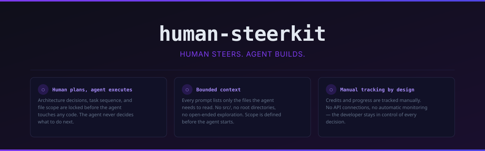

# human-steerkit



<p align="center">
  <strong>Every wasted AI agent credit traces back to the same root causes:</strong><br/><br/>
  the agent re-discovers scope it was never told &nbsp;·&nbsp;
  scans files it did not need to read &nbsp;·&nbsp;
  debates architecture mid-task &nbsp;·&nbsp;
  receives a vague prompt and outputs long back-and-forth
  <br/><br/>
  <strong>human-steerkit</strong> eliminates all of these <em>before</em> the agent starts —
  turning your project into a sequence of bounded, file-scoped prompts
  the agent can execute without guessing.
</p>

[](https://www.npmjs.com/package/human-steerkit)
[](https://www.npmjs.com/package/human-steerkit)
[](https://github.com/ssthil/human-steerkit/actions/workflows/ci.yml)
[](https://opensource.org/licenses/MIT)

## Demo


## Installation

```bash
npm install -g human-steerkit
```

Or use without installing:

```bash
npx human-steerkit init
```

## Quick start

```bash
hsk init                      # answer 6 questions, scaffold your project files
hsk next                      # get a bounded prompt for the next pending task
hsk next --copy               # same, and copy the prompt straight to clipboard
# paste prompt into your agent, run the task
hsk done 1                    # mark task 1 complete
hsk spend 1 12                # record 12 credits used on task 1
hsk status                    # see progress and budget summary
hsk report                    # per-task credit breakdown: estimates vs actuals
```

## How it works

1. **`hsk init`** asks 6 questions (project name, goal, stack, agent tool, budget, task count) and generates `PROJECT.md`, `TASKS.md`, `DECISIONS.md`, and `PROMPTS.md` in your project root — pre-filled with your answers and a task list from your chosen template.

2. **`hsk next`** reads your `TASKS.md`, finds the first unchecked task, and outputs a ready-to-paste prompt in a fixed format: the exact files to read, the task description, the expected output, and a constraints block that prevents the agent from over-generating.

3. **You run one task at a time.** Mark it done with `hsk done <n>`, record the credit cost with `hsk spend <n> <credits>`, and repeat. `hsk check` scans for patterns that waste credits before you hand off to the agent.

## Commands

| Command | Description |
|---|---|
| `hsk init` | Interactive wizard — scaffolds project files and folder structure |
| `hsk task <n>` | Generate bounded agent prompt for task number n |
| `hsk task <n> --copy` | Generate prompt and copy it to clipboard |
| `hsk next` | Find first pending task and output its prompt |
| `hsk next --copy` | Find next task, output prompt, and copy to clipboard |
| `hsk add` | Interactively add a new task to TASKS.md |
| `hsk done <n>` | Mark task n complete in TASKS.md |
| `hsk status` | Show task progress and budget summary |
| `hsk report` | Per-task credit breakdown: estimates vs actuals |
| `hsk check` | Scan project for credit-wasting patterns |
| `hsk spend <n> <credits>` | Record actual credits used for task n |
| `hsk budget <total>` | Set total credit budget |

## Templates

| Template | Stack | Tasks |
|---|---|---|
| `fullstack-py` | Next.js + FastAPI + SQLite | 20 |
| `nextjs-app-router` | Next.js App Router + Prisma + TypeScript | 12 |
| `nextjs-api` | Next.js + API Routes + TypeScript | 14 |
| `supabase` | Next.js App Router + Supabase | 12 |
| `fastapi-only` | FastAPI + SQLite | 12 |
| `express-api` | Node.js + Express + SQLite | 12 |
| `blank` | Any stack | 0 |

## Credit waste checker

`hsk check` scans `PROJECT.md`, `DECISIONS.md`, `TASKS.md`, and `PROMPTS.md` for these patterns:

| Rule | Problem | Fix |
|---|---|---|
| `PROJECT_MISSING` | Agent re-discovers scope every session | Run `hsk init` |
| `DECISIONS_MISSING` | Agent debates architecture mid-task | Run `hsk init` |
| `TASKS_MISSING` | No task sequence — agent decides what to do | Run `hsk init` |
| `TASK_MISSING_READS` | Agent scans whatever files it finds | Add `reads` field to task |
| `TASK_READS_TOO_BROAD` | `reads: src/` causes full codebase scan | Narrow to specific files |
| `TASK_READS_TOO_MANY` | More than 8 files — context too large | Split task into two |
| `TASK_DESCRIPTION_TOO_SHORT` | Agent asks clarifying questions | Expand description |
| `PROMPTS_MISSING_CONSTRAINTS` | Agent over-generates output | Add constraints block |

## Philosophy

- **Human plans, agent executes.** Architecture decisions, task sequence, and file scope are locked before the agent touches any code. The agent never decides what to do next.
- **Bounded context.** Every prompt lists only the files the agent needs to read. No `src/`, no root directories, no open-ended exploration.
- **Manual tracking by design.** Credits and progress are tracked manually. No API connections, no automatic monitoring — the developer stays in control of every decision.

## Contributing

Contributions are welcome. The fastest way to contribute is to add a new stack template — templates are plain JSON files in `src/templates/` that follow a simple schema. No TypeScript required. Copy an existing template, fill in the task list for your stack, and open a pull request.

## License

MIT
